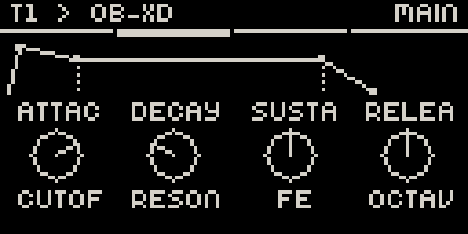
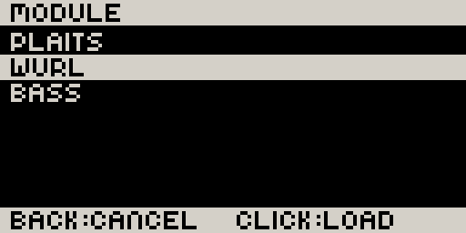
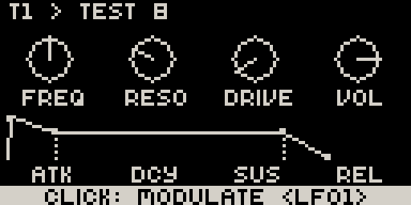
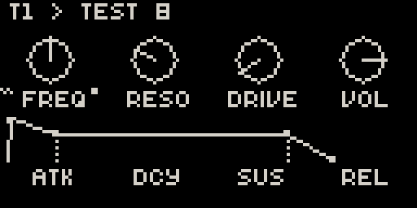
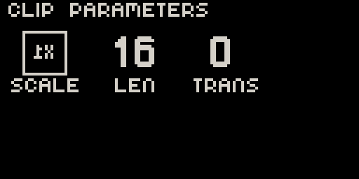
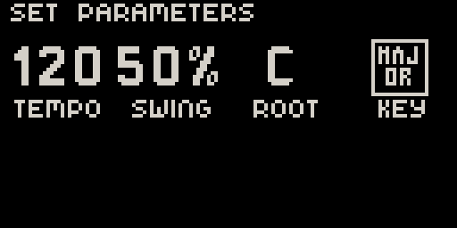
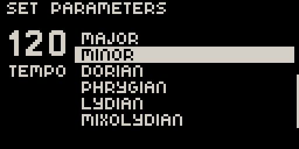

# Movy — Manual

This manual explains how to use **Movy**, an Elektron-style knob UI and 4-track
sequencer for Schwung on Ableton Move. For an overview and screenshots, see the
[README](README.md).

> **Movy is an early prototype.** Behaviour may change, and some things described
> here are deliberately minimal. If something doesn't work as written, that's a
> [bug report](#reporting-bugs) waiting to happen.

### A note on Move

Movy's sequencer is **deliberately aligned with Ableton Move's own sequencer**.
Rather than re-document everything Move already explains well, this manual:

- **points you to the official Move manual** for the shared concepts, and
- **focuses on what's different** — the Movy-specific gestures, the three new
  parameter pages, and the current limitations.

If you're new to Move's clips, Session view, recording, and automation, read the
official docs first:

- [Move manual (PDF)](https://cdn-resources.ableton.com/resources/pdfs/move-manual/1/2024-10-04/move1-manual-en.pdf)
- [Move beta release notes](https://www.ableton.com/en/release-notes/move-1-beta/)

---

## Contents

1. [Concepts & screen layout](#1-concepts--screen-layout)
2. [Parameter pages](#2-parameter-pages)
3. [The module chain](#3-the-module-chain)
4. [Keyboard & drums](#4-keyboard--drums)
5. [The sequencer (aligned with Move)](#5-the-sequencer-aligned-with-move)
6. [Beyond Move: Step, Clip & Set parameters](#6-beyond-move-step-clip--set-parameters)
7. [Limitations vs Move](#7-limitations-vs-move)
8. [Controls reference](#8-controls-reference)
9. [Troubleshooting & recovery](#9-troubleshooting--recovery)

---

## 1. Concepts & screen layout

Movy runs as a Schwung **tool** on top of Move. While it's open, Move's firmware
and the Schwung audio chain keep running underneath — Movy just takes over the
screen, pads, knobs, and buttons.

You're always working with **one of four tracks** at a time. Each track is a
Schwung chain of up to four module slots, plus a per-track **LFO** page:

```
MIDI FX  →  SYNTH  →  FX 1  →  FX 2  →  LFO
```

The **screen** is the 128×64 OLED. A typical parameter page looks like this:



- **Header** (top): the track on the left (e.g. `T1`), the module/bank name on
  the right.
- **Knob row(s)**: up to 8 parameters, drawn as knobs with a value and a short
  label. The currently-touched knob shows its full value in an inverted style.
- **Page indicator**: a thin strip showing which page of the module you're on.

The general UI rule (borrowed from Move): **only controls that do something are
lit**, and a button glows at full brightness while it's actively doing its job.

### The views

| View | What it shows |
| --- | --- |
| **Chain** | The current track's module slots (MIDI FX, Synth, FX 1, FX 2) and the LFO page; jog scrolls them. |
| **Knobs** | One module's parameter page; jog scrolls that module's pages. |
| **Keys** | The chromatic keyboard (or a drum rack on drum tracks). |
| **Browse** | The module browser (pick a module to load into a slot). |
| **Session** | The clip grid for launching clips; also exposes the master FX chain. |

You move between Chain → Knobs by **clicking the jog wheel** to drill in, and
**Back** to step back out (and eventually out of Movy).

---

## 2. Parameter pages

Movy reads each module's parameter hierarchy from Schwung and renders it
automatically. You don't configure anything for most modules.

- **Knobs / arc knobs** — continuous parameters are drawn as a circular knob
  with a pointer; the on-screen arc follows the value (including when automation
  moves it).
- **Enum knobs & the enum overlay** — list-type parameters (waveforms, modes…)
  show the current choice in a square. Touching the knob opens a **full-screen
  scrollable list** so you can see all the options:

  

- **Envelope graphics** — when a page contains a recognisable
  Attack/Decay/Sustain/Release group, Movy draws it as a **single envelope
  shape** instead of four separate knobs, which is far easier to read:

  

- **Multiple pages** — modules with more than 8 parameters split into pages
  (`MAIN`, `PAGE 1`, `PAGE 2`, …). Scroll them with the jog wheel (or Left/Right
  when the sequencer isn't using those buttons).

Turning a knob edits the parameter live. Touching a knob (without turning) shows
its exact value at the top of the screen.

---

## 3. The module chain

In **Chain** view you see the slots of the current track:


- **Jog wheel** scrolls between slots (MIDI FX, Synth, FX 1, FX 2, and the LFO
  page).
- **Jog click** on a loaded slot **drills into** that module's parameter pages.
- **Jog click** on an empty slot — or **Shift + jog click** on any slot — opens
  the **module browser** to load/swap the module in that slot:

  

  Scroll with the jog wheel; click to load; Back to cancel.

- **Back** returns from a module's pages to the chain, and from the chain it
  exits Movy.

In **Session** view, the same navigation applies to a **master FX chain**
(MFX 1–4) that processes the whole mix.

### The LFO page

The last page in the chain is **LFO** — two low-frequency oscillators that can
modulate any automatable parameter in the track's chain. Jog-click it to drill
in; the jog then scrolls between **LFO 1** and **LFO 2**.


Each LFO has eight controls:

| Knob | Control | Notes |
| --- | --- | --- |
| **RATE** | Rate | Free-running Hz, or a musical division when **Sync** is on. |
| **SYNC** | Sync | Free-running vs tempo-synced. When synced, the LFO **phase-locks** to the playing transport (see below). |
| **MODE** | Mode | Unipolar (`UNI`) or bipolar (`BI`). |
| **TARGET** | Target | The parameter this LFO modulates (see below); `✕` = none. |
| **SHAPE** | Shape | Sine / Tri / Saw / Square / S&H / Swishy. |
| **PHASE** | Phase | Start-phase offset, in 15° steps. |
| **RETRIG** | Retrigger | Reset the LFO on each new note. |
| **DEPTH** | Depth | Modulation amount. |

**Shape** and **Phase** are drawn together as a live **waveform preview**: turn
Shape to morph the wave, Phase to slide it along. A dotted baseline shows the
mode (centred = bipolar, along the bottom = unipolar), and a bold dot marks the
start when Retrigger is on.

**Synced LFOs phase-lock to the transport.** With **Sync** on, a running
transport drives the LFO's phase directly from song position — the cycle is
bar-aligned and stays drift-free no matter how long it plays. It follows
whichever transport is playing: Movy's own sequencer, or Move's native
sequencer when that is running. **Phase** then becomes a musical offset against
the bar. When the transport **stops**, the LFO keeps breathing — it free-runs
from where it was, at the tempo it was last playing (it does not snap to a
different rate). One caveat: changing the tempo *while stopped* doesn't change a
free-running synced LFO's rate until you play again.

You can pick an LFO's Target here (an overlay lists every modulatable parameter
in the chain), but the easy way is to assign it from the parameter itself:

### Modulating a parameter with an LFO

On any module's parameter page, **hold an (automatable) knob** for about a second
without turning it. A prompt appears at the bottom:



- **Turn the jog** to choose `LFO1` or `LFO2`.
- **Click the jog** to assign — that LFO now modulates the parameter, and you
  jump to its LFO page to set rate, shape, and depth.

Hold the same knob again to **remove** the modulation (or, from the other LFO,
add a second one to the same parameter). A modulated parameter shows a small
**`~` mark** by its label — alongside the automation dot if it's also automated:



While a parameter is modulated its on-screen knob stays at your **base value** —
the LFO moves the sound, not the displayed knob.

---

## 4. Keyboard & drums

### Chromatic keyboard

On a melodic track the 32 pads form a **two-octave chromatic keyboard** (a piano
layout across two rows of white keys with the black keys above):


- **+ / −** (Up/Down buttons) shift the layout by an octave.
- The root note is shown in the header.

> **Chromatic only.** Movy does not (yet) offer Move's scale-aware pad layouts
> (*In Key* / in-scale, or the guitar-style in-scale layout). See
> [Limitations](#7-limitations-vs-move).

### Drums

When a **drum module** is loaded, Movy switches the pads to a **4×4 drum rack**
and the screen to drum-oriented parameter pages, including **per-pad pages** (a
page that controls just the selected drum voice — marked with a pad icon):


Because there's no other way to choose a drum type on the device, drum modules
rely on Movy's **layout templates**. Mr Drums and Weird Dreams are tested; other
drum modules may need a template contributed (see
[CONTRIBUTING.md](CONTRIBUTING.md)).

---

## 5. The sequencer (aligned with Move)

Movy's sequencer is built to **feel like Move's**, for four Schwung tracks. The
following all work essentially as they do on Move — refer to the
[Move manual](https://cdn-resources.ableton.com/resources/pdfs/move-manual/1/2024-10-04/move1-manual-en.pdf)
for the concepts:

- **Clips** — one clip per track slot; steps entered on the 16 step buttons.
- **Session view & clip launching** — press **Note/Session** to see the clip
  grid; pads launch clips. Hold it for a momentary peek; tap to latch.
- **Live recording** — **Rec** arms recording with a one-bar **count-in**; play
  the pads to record. Clips start only after the count-in.
- **Metronome** — toggle with **Shift + Step 6**.
- **Step entry & editing** — tap a step to toggle a note; **hold a step** to edit
  it (and to open its [step parameters](#6-beyond-move-step-clip--set-parameters)).
- **Note length** — **hold step A, then press step B** to set A's length up to B.
- **Loop / bars** — the **Loop** button shows the bar overview; **Left/Right**
  navigate bars. **Shift + Step 15** doubles the loop.
- **Duplicate / delete** — **Copy** and **Delete** (a.k.a. Clear) act on steps,
  clips, or bars depending on context.
- **Quantize** — **Shift + Step 16**.
- **Mute** — hold **Mute** and press a track button to mute that track.
- **Automation** — turn a module knob while recording (or while holding a step)
  to record parameter automation; the on-screen knob arc follows the automation.

  

Because Movy keeps the module's parameters on screen during sequencing, some of
Move's full-screen sequencer displays are replaced by **LED feedback on the pads
and step buttons** plus a bar/position indicator and brief on-screen
announcements. The lighting follows Move's conventions (play = green, record =
red, only actionable buttons lit, the playhead sweeps the step row, etc.).

> **Note:** Movy's sequencer intentionally does **not** copy Davebox's timing
> where Davebox deviates from Move — the goal is to match native Move.

---

## 6. Beyond Move: Step, Clip & Set parameters

These three pages add control Move doesn't expose on-device. Each opens with a
**Shift + Step** combination (or, for step parameters, by holding a step).

### Step parameters — per-trig locks

**Hold a step** that has a note. While held, **page 0** becomes the **Step**
page, showing that trig's intrinsic properties on the knobs:


| Knob | Parameter | Notes |
| --- | --- | --- |
| 1 | **VEL** | Velocity for this trig. |
| 2 | **LEN** | Note length. |
| 3 | **PROB** | Probability the trig fires (0–100%). |
| 4 | **COND** | Trig condition (e.g. `2:3` = fire on the 2nd of every 3 cycles). |
| 5 | **INV** | Invert — flips the condition. |

This is Movy's take on Elektron-style **parameter locks**: a per-step,
per-parameter override. (While a step is held, jog/Left/Right can still roam the
module pages so a single held step can automate across the chain.)

### Clip parameters — Shift + Step 3

In Track view, **Shift + Step 3** opens the **Clip** page for the active clip:



| Knob | Parameter |
| --- | --- |
| 1 | **SCALE** — the clip's musical scale. |
| 2 | **LEN** — clip length in steps. |
| 3 | **TRANS** — transpose. |

(Clip parameters apply to a single clip, so this page is Track-view only.)

### Set parameters — Shift + Step 5 / 7 / 9

**Shift + Step 5, 7, or 9** opens the global **Set** page:



| Knob | Parameter |
| --- | --- |
| 1 | **TEMPO** |
| 2 | **SWING** |
| 3 | **ROOT** |
| 4 | **KEY** |

The KEY knob opens a scale/mode list (the same scrollable enum overlay used
elsewhere):



These are set-wide (they affect all tracks).

Press **Back** (or a track button) to close any of these pages and return to
where you were.

---

## 7. Limitations vs Move

Movy aims to match Move, but it's an early prototype and several things are
missing or simplified. **All of these are candidates for future work — and
[contributions are welcome](CONTRIBUTING.md).**

- **No undo.** There's no undo history; edits are immediate.
- **No capture.** Move's retroactive capture (play freely, then capture what you
  just played) is out of scope.
- **Chromatic keyboard only.** No scale-aware pad layouts (*In Key* / in-scale,
  or the guitar-style in-scale layout). The Set page's KEY/ROOT affect the
  sequencer's scale, but the pads stay chromatic.
- **Four Schwung tracks only.** Movy sequences four Schwung chains — not Move's
  native instruments, drum racks, or sampler.
- **Simplified clip model.** Sequencer resolution and some clip-level features
  are reduced compared to Move.
- **Rough edges.** Expect occasional display glitches or, rarely, a crash that
  needs a [recovery](#9-troubleshooting--recovery).

If a missing feature matters to you, please open an issue describing the Move
behaviour you'd like — or, better, a PR.

---

## 8. Controls reference

### Parameter / chain views

| Control | Action |
| --- | --- |
| **Knobs 1–8** | Edit the current page's parameters. Touch (no turn) shows the exact value. |
| **Hold a knob (~1 s)** | Assign that parameter as an **LFO target**: jog picks LFO 1/2, jog-click assigns (hold again to remove). Automatable parameters only. |
| **Jog wheel — turn** | Scroll chain slots (Chain view) or module pages (Knobs view) / browser list. On the LFO page, scroll between LFO 1 and LFO 2. |
| **Jog wheel — click** | Drill Chain → module pages; on Knobs (or an empty slot) open the module browser; in a browser, load the selection. |
| **Shift + jog click** | Open the module browser to swap the current slot's module. |
| **Back** | Module pages → Chain; Chain → exit Movy; browser → cancel. |
| **+ / −** (Up/Down) | Shift the chromatic keyboard by an octave (melodic tracks only). |

### Sequencer

| Control | Action |
| --- | --- |
| **Step buttons 1–16** | Toggle a note on/off at that step. |
| **Hold a step** | Edit that step; opens its **Step parameters** (page 0). |
| **Hold step A + press step B** | Set step A's note length up to B. |
| **Hold a step + pad** | Edit that step's notes from the keyboard. |
| **Play** | Start / stop the transport. |
| **Rec** | Arm recording (one-bar count-in). |
| **Note / Session** | Show the Session clip grid (momentary hold = peek, tap = latch). Pads launch clips. |
| **Loop** | Toggle the bar/loop overview; hold + jog resizes the loop. |
| **Left / Right** | Navigate bars (or nudge held steps). |
| **Copy** | Duplicate a step / clip / bar (context-dependent). |
| **Delete (Clear)** | Delete a step / clip / bar; in Session, delete a clip. Hold + knob-touch clears that knob's automation lane. |
| **Mute + track** | Mute that track. |
| **Track buttons 1–4** | Select a track (hold = momentary peek). |
| **Volume encoder** | Adjust held steps' velocity. |

### Shift + Step shortcuts

| Combo | Action |
| --- | --- |
| **Shift + Step 3** | Open **Clip parameters** (Track view). |
| **Shift + Step 5 / 7 / 9** | Open **Set parameters** (tempo/swing/root/key). |
| **Shift + Step 6** | Toggle the **metronome**. |
| **Shift + Step 10** | Toggle **full velocity**. |
| **Shift + Step 15** | **Double** the loop. |
| **Shift + Step 16** | **Quantize** the current track. |

---

## 9. Troubleshooting & recovery

- **Movy looks frozen or the screen is stale.** Press **Back** to leave and
  re-open Movy from the Tools menu. Movy keeps running in the background; on most
  Schwung builds you can re-enter by holding **Shift + Step 13**.
- **The audio engine (MoveOriginal) crashed.** A sequencer engine bug should be
  caught before it can take down Move, but if audio dies, a full restart of the
  Schwung stack recovers it (see the build/test notes in
  [CONTRIBUTING.md](CONTRIBUTING.md) / the project's developer docs).
- **A module's parameters look wrong or empty.** It may need a layout template.
  Note the module and open an issue (or contribute a template).

### Reporting bugs

Movy is a prototype, so good bug reports really help. Please include:

1. **What you did** — a numbered list of steps.
2. **What you expected** to happen.
3. **What actually happened.**
4. **Which modules** were loaded in the chain (and on which track).
5. Anything from the device log if you can grab it.

A reproducible report (steps that reliably trigger the problem) is worth far
more than a screenshot of a broken screen. Thank you! 🙏
