# Movy — Manual

This manual explains how to use **Movy**, an Elektron-style knob UI and 4-track
sequencer for Schwung on Ableton Move. For an overview and screenshots, see the
[README](README.md).

> **Movy is an early prototype.** Behaviour may change, and some things described
> here are deliberately minimal. If something doesn't work as written, that's a
> [bug report](#reporting-bugs) waiting to happen.

### A note on Move

Movy's sequencer is **deliberately aligned with Ableton Move's own sequencer**.
Rather than re-document everything Move already explains well, this manual:

- **points you to the official Move manual** for the shared concepts, and
- **focuses on what's different** — the Movy-specific gestures, the three new
  parameter pages, and the current limitations.

If you're new to Move's clips, Session view, recording, and automation, read the
official docs first:

- [Move manual (PDF)](https://cdn-resources.ableton.com/resources/pdfs/move-manual/1/2024-10-04/move1-manual-en.pdf)
- [Move beta release notes](https://www.ableton.com/en/release-notes/move-1-beta/)

---

## Contents

1. [Concepts & screen layout](#1-concepts--screen-layout)
2. [Parameter pages](#2-parameter-pages)
3. [The module chain](#3-the-module-chain)
4. [Keyboard & drums](#4-keyboard--drums)
5. [The sequencer (aligned with Move)](#5-the-sequencer-aligned-with-move)
6. [Beyond Move: Step, Clip & Set parameters](#6-beyond-move-step-clip--set-parameters)
6a. [Undo & redo](#6a-undo--redo)
7. [Limitations vs Move](#7-limitations-vs-move)
8. [Controls reference](#8-controls-reference)
9. [Troubleshooting & recovery](#9-troubleshooting--recovery)

---

## 1. Concepts & screen layout

Movy runs as a Schwung **tool** on top of Move. While it's open, Move's firmware
and the Schwung audio chain keep running underneath — Movy just takes over the
screen, pads, knobs, and buttons.

You're always working with **one of four tracks** at a time. Each track is a
Schwung chain of up to four module slots, plus a per-track **LFO** page:

```
MIDI FX  →  SYNTH  →  FX 1  →  FX 2  →  LFO
```

The **screen** is the 128×64 OLED. A typical parameter page looks like this:

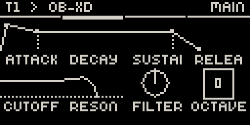

- **Header** (top): the track on the left (e.g. `T1`), the module/bank name on
  the right.
- **Knob row(s)**: up to 8 parameters, drawn as knobs with a value and a short
  label. The currently-touched knob shows its full value in an inverted style.
- **Page indicator**: a thin strip showing which page of the module you're on.

The general UI rule (borrowed from Move): **only controls that do something are
lit**. A dark button does nothing where you are; a dim one is waiting to be
pressed; and a button goes to full brightness while it's actively doing its job
— or simply while you're holding it down.

### The views

| View | What it shows |
| --- | --- |
| **Chain** | The current track's module slots (MIDI FX, Synth, FX 1, FX 2) and the LFO page; jog scrolls them. |
| **Knobs** | One module's parameter page; jog scrolls that module's pages. |
| **Keys** | The melodic keyboard (or a drum rack on drum tracks). |
| **Browse** | The module browser (pick a module to load into a slot). |
| **Session** | The clip grid for launching clips; also exposes the master FX chain. |

You move between Chain → Knobs by **clicking the jog wheel** to drill in, and
**Back** to step back out (and eventually out of Movy).

Not sure what the jog does on the page you are on? **Rest a finger on it** for
about a second without turning: a prompt at the bottom tells you what a click
will do there. Turning it (or letting go) dismisses the prompt, so scrolling
never puts it in your way.

---

## 2. Parameter pages

Movy reads each module's parameter hierarchy from Schwung and renders it
automatically. You don't configure anything for most modules.

- **Knobs / arc knobs** — continuous parameters are drawn as a circular knob
  with a pointer; the on-screen arc follows the value (including when automation
  moves it).
- **Enum knobs & the enum overlay** — list-type parameters (waveforms, modes…)
  show the current choice in a square. Touching the knob opens a **full-screen
  scrollable list** so you can see all the options:

  

- **Envelope graphics** — when a page contains a recognisable
  Attack/Decay/Sustain/Release group, Movy draws it as a **single envelope
  shape** instead of four separate knobs, which is far easier to read:

  

  Shorter envelopes are drawn too: a two-stage **Attack/Decay** (or Attack/
  Release) becomes a two-cell graphic, and a three-stage **Attack/Sustain/
  Release** a three-cell one, leaving the other knobs on the line untouched.

  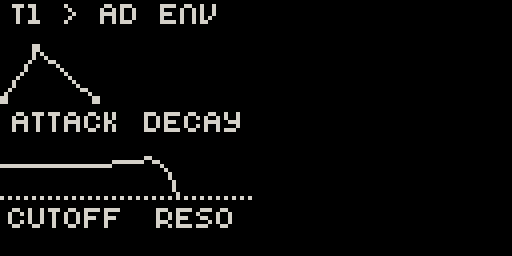
  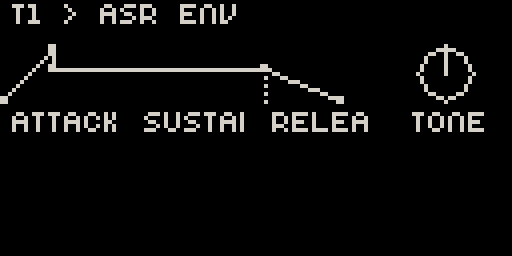

- **LFO waveform graphics** — when a page carries a module's own LFO, Movy
  pairs its **Shape** with one neighbour and reorders them onto the same line,
  drawing the two cells as a live **waveform preview** — sine, triangle, saw,
  square, sample & hold, noise, and more. The partner shapes the drawing:
  **phase** offsets it, **rate** sets the cycle count (1–2 cycles, so it stays
  readable), and **depth** its height; the LFO's deform/symmetry skews it and
  uni/bipolar flips the baseline. The other LFO knobs stay put.

  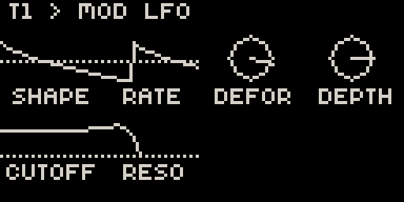

  Modules name these things differently, and Movy reads the common variants —
  a rate called *Frequency*, a depth called *Amp*, a shape list using *Saw Up*
  or *Sample & Glide*, and keys that run the two together (`lfo1rate`). Helm's
  stepped families get their own silhouettes: **N Step** climbs in levels,
  **N Pyramid** climbs and falls again.

  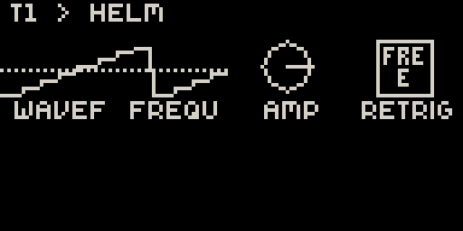
  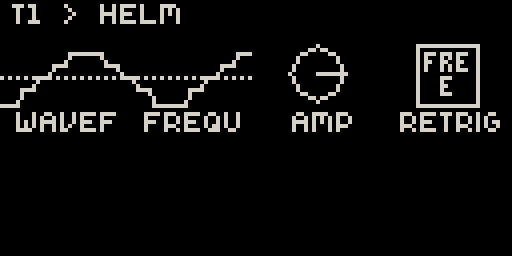

- **Filter graphics** — when a page carries a **cutoff + resonance** pair, Movy
  reorders them onto the same line (cutoff, then resonance) and draws a live
  **filter-response curve** across the two cells. Read it left-to-right as
  frequency: the **corner sits at the cutoff** and **resonance is the size of
  the bump** at that corner. The shape follows the filter type — a low-pass
  passes the left and rolls off after the corner; a high-pass mirrors it; band-
  pass is a hump; notch a dip:

  
  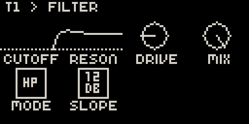
  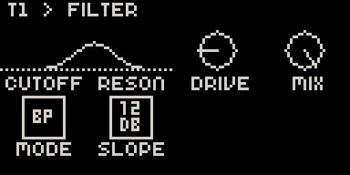

  The type is taken from a `MODE`/`TYPE` enum on the page (turning it re-shapes
  the curve immediately), or from a filter-type control elsewhere in the module,
  or inferred from the parameter's own name (`lpf_`/`hpf_` etc.). A `SLOPE`
  control (12/24 dB) steepens the roll-off. Pages with two filters — e.g. a
  separate low-pass and high-pass — draw one curve per line:

  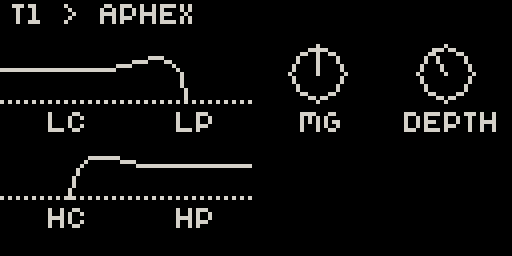

- **Multiple pages** — modules with more than 8 parameters split into pages
  (`MAIN`, `PAGE 1`, `PAGE 2`, …). Scroll them with the jog wheel (or Left/Right
  when the sequencer isn't using those buttons). The line under the title is the
  page indicator, and it maps the sections rather than just counting pages: the
  pages of one section sit flush together, a one-pixel gap marks where the next
  section starts, and the current page is drawn taller. So a wide block means a
  section that spans several pages, and you can see at a glance which one you
  are in — the same grouping Shift + jog steps through. It always spans the full
  width, even on a module with 70 pages across 51 sections:

  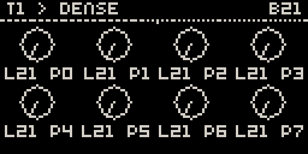

**Every page a module offers.** Movy builds one page per section the module
declares, following both its own menu and any section it delegates to, however
deeply they nest. Param-dense synths therefore have a lot of pages — *Helm* has
30, *MiniJV* 49, *Dexed* 23 — all reached by scrolling. Two details keep that
readable:

- A section nested inside another is named `Parent/Child`, with the parent
  shortened to fit the header, so sibling sections stay apart (*Dexed*'s six
  operator envelopes read `Oper1/Envelope`, `Oper2/Envelope`, …).

  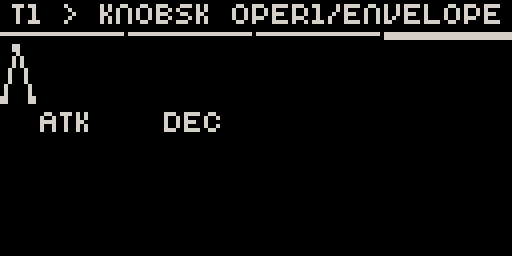

- A section that merely repeats another one's knobs is shown once, so modules
  that publish the same eight knobs twice no longer waste a page on it.

**The whole section, not just its eight knobs.** A module gives each section two
things: the eight parameters it binds to the encoders, and the full list of
parameters that section contains. Movy shows the eight first, then continues the
rest onto `- 2`, `- 3` pages under the same section name. That is what makes
*Osirus*'s ROM/model selector, *OB-Xd*'s voice count and *Surge*'s per-oscillator
detail reachable — several hundred parameters that were previously visible only
in Move's own module UI:

  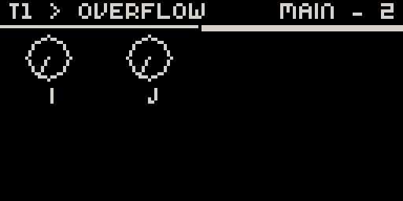

A section that binds **no** encoders at all now gets a page too, instead of
being skipped:

  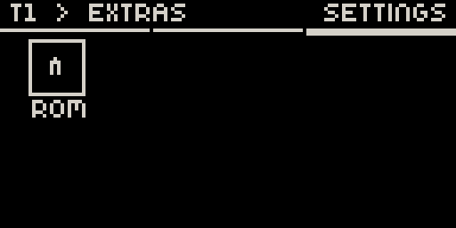

Parameters the module reports as unturnable (a single possible value) are left
out — a knob that cannot move is noise. Some modules publish their preset list
and option names a moment *after* they load (Osirus scans its ROM); Movy keeps
looking for a few seconds and redraws the pages as soon as the real names
arrive.

**Jumping between sections.** With many pages, stepping one at a time is slow:
hold **Shift** and turn the jog wheel to jump straight to the previous/next
*section*, skipping its overflow pages. Turning the jog wheel without Shift
still moves one page at a time.

Even a module that publishes no parameter hierarchy still gets pages — Movy lays
its parameters out in the order the module exposes them (this is what brings
modules like *Branchage*, *Smack-in* and *Belt-in* to life). When a parameter
also ships no range information, Movy shows a best-guess control and refines it
(for example to a whole-number range) the first time it reads the real value.

**Action knobs.** A module can mark a parameter as a one-shot *action* rather
than a value — Smack's Capture, Arm and Reroll, for example. Movy draws these as
a **circle in a box** instead of a knob, because there is no value to set:

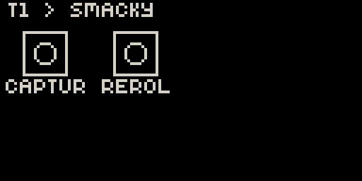

Turn the knob **clockwise** to fire. The circle blinks and the knob's own LED
flashes, so you know it happened without watching the screen:

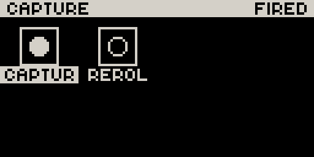

One turn fires **once**, however far you keep turning — a whole sweep of the knob
is a single action, not a burst of them. While it is spent the box goes dashed and
a small bar drains along the top, showing when it re-arms by itself:

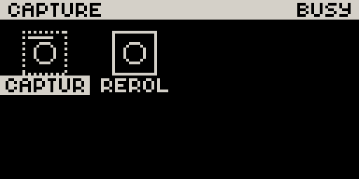

So there are two ways to fire again: turn **counter-clockwise** to re-arm
immediately, or just stop and let the bar run out. The name under the icon
highlights while you are touching the knob, exactly like every other control.

Wide-range controls can also opt into slow single-step turns plus fast
acceleration through the module's `knob_acceleration` metadata, so a 1–9999 seed
moves one step at a time when you turn deliberately and travels quickly when you
sweep.

**Curated layouts.** A few modules get a hand-tuned page layout so their controls
are grouped and named clearly, and so useful parameters the automatic layout
would hide become reachable. These include *Plaits*, *Wurl*, *Chordism*, *SFZ*,
*303*, *Chiptune* and *Hush1* (plus the drum modules). For instance, Chordism's
**Chord Multi** mode now reaches **all twelve** pitch classes — the automatic
layout could only expose the lower eight, so chords using the top four notes
(G♯, A, A♯, B) were previously impossible to build:

  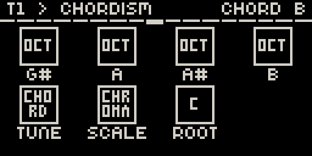

Turning a knob edits the parameter live. Touching a knob (without turning) shows
its exact value at the top of the screen.

---

## 3. The module chain

In **Chain** view you see the slots of the current track:


- **Jog wheel** scrolls between slots (MIDI FX, Synth, FX 1, FX 2, and the LFO
  page).
- **Jog click** on a loaded slot **drills into** that module's parameter pages.
- **Jog click** on an empty slot — or **Shift + jog click** on any slot — opens
  the **module browser** to load/swap the module in that slot:

  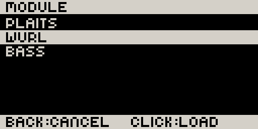

  Scroll with the jog wheel; click to load; Back to cancel.

- **Back** returns from a module's pages to the chain, and from the chain it
  exits Movy.

In **Session** view, the same navigation applies to a **master FX chain**
(MFX 1–4) that processes the whole mix.

### Track volume

**Hold a track button and turn the volume encoder** to set that track's volume.
The range runs 0–400%, where **100% is unity** — the tick under the bar. Above
that you are boosting, so watch for clipping.


**One detent is one dB**, the whole way down. The readout shows both the
percentage Schwung stores and the gain in dB, so quiet settings are as easy to
place as loud ones — from −9 dB there are another 39 steps before the fader
reaches silence at the bottom of its travel.

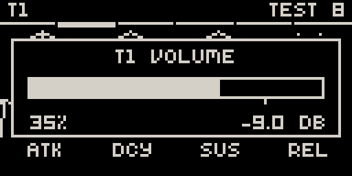

Whether you see *this* slider depends on Shift. Move's firmware takes over the
screen for as long as you are touching the volume knob, so:

- **Track + volume** — Move draws its own volume overlay. The track volume still
  changes; you just see Move's display of it.
- **Shift + track + volume** — Movy keeps the screen and shows the slider above.

Either way the value belongs to the track's Schwung slot, and it survives
leaving and re-entering Movy.

### The LFO page

The last page in the chain is **LFO** — two low-frequency oscillators that can
modulate any automatable parameter in the track's chain. Jog-click it to drill
in; the jog then scrolls between **LFO 1** and **LFO 2**.


Each LFO has eight controls:

| Knob | Control | Notes |
| --- | --- | --- |
| **RATE** | Rate | Free-running Hz, or a musical division when **Sync** is on. |
| **SYNC** | Sync | Free-running vs tempo-synced. When synced, the LFO **phase-locks** to the playing transport (see below). |
| **MODE** | Mode | Unipolar (`UNI`) or bipolar (`BI`). |
| **TARGET** | Target | The parameter this LFO modulates (see below); `✕` = none. |
| **SHAPE** | Shape | Sine / Tri / Saw / Square / S&H / Swishy. |
| **PHASE** | Phase | Start-phase offset, in 15° steps. |
| **RETRIG** | Retrigger | Reset the LFO on each new note. |
| **DEPTH** | Depth | Modulation amount. |

**Shape** and **Phase** are drawn together as a live **waveform preview**: turn
Shape to morph the wave, Phase to slide it along. A dotted baseline shows the
mode (centred = bipolar, along the bottom = unipolar), and a bold dot marks the
start when Retrigger is on.

**Synced LFOs phase-lock to the transport.** With **Sync** on, a running
transport drives the LFO's phase directly from song position — the cycle is
bar-aligned and stays drift-free no matter how long it plays. It follows
whichever transport is playing: Movy's own sequencer, or Move's native
sequencer when that is running. **Phase** then becomes a musical offset against
the bar. When the transport **stops**, the LFO keeps breathing — it free-runs
from where it was, at the tempo it was last playing (it does not snap to a
different rate). One caveat: changing the tempo *while stopped* doesn't change a
free-running synced LFO's rate until you play again.

You can pick an LFO's Target here (an overlay lists every modulatable parameter
in the chain), but the easy way is to assign it from the parameter itself:

### Modulating a parameter with an LFO

On any module's parameter page, **hold an (automatable) knob** for about a second
without turning it. A prompt appears at the bottom:

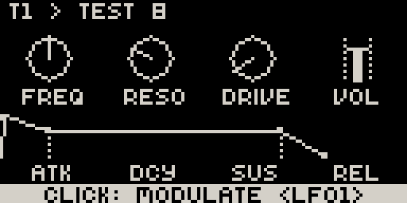

- **Turn the jog** to choose `LFO1` or `LFO2`.
- **Click the jog** to assign — that LFO now modulates the parameter, and you
  jump to its LFO page to set rate, shape, and depth.

Hold the same knob again to **remove** the modulation (or, from the other LFO,
add a second one to the same parameter). A modulated parameter shows a small
**`~` mark** by its label — alongside the automation dot if it's also automated:

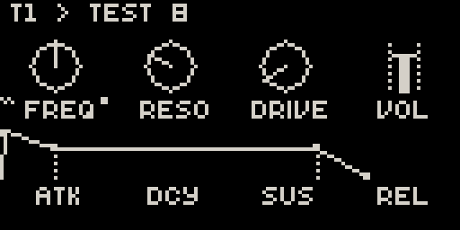

While a parameter is modulated its on-screen knob stays at your **base value** —
the LFO moves the sound, not the displayed knob.

---

## 4. Keyboard & drums

### Melodic keyboard

On a melodic track the 32 pads form a playable keyboard whose shape you choose:


- **+ / −** (Up/Down buttons) shift **the active track's** octave. Each track
  keeps its own octave, saved with the set — so a bass part stays low when you
  come back to it, even after a device restart.
- The root note is shown in the header.
- Pads are coloured by the current key: the tonic takes the track colour, other
  in-scale notes light grey, out-of-scale notes stay dark.

### Pad layouts

Two knobs on the [Set parameters](#set-parameters--shift--step-5--7--9) page
(**Shift + Step 5 / 7 / 9**) decide the grid's shape:

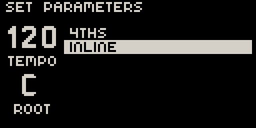

**MODE** picks the note set:

- **Chromatic** — every semitone is reachable; the KEY setting only colours the
  pads.
- **In Key** — the grid folds to the scale, so every pad is in key and a wrong
  note is impossible.

**LAYOUT** picks the geometry, and its options follow MODE:

| MODE | LAYOUT | Grid |
| --- | --- | --- |
| Chromatic | **4th** | +1 semitone per pad to the right, +5 (a fourth) per row up. The root sits on the **4th pad of the bottom row**, leaving three pads below it. |
| Chromatic | **Piano** | Rows 1 and 3 are the white keys (C–C), the row above each holds the black keys, offset right so a black key sits above the white note it leads into. Three pads per black row have no key and stay dark and silent. Two octaves on the grid. |
| In Key | **4th** | Three scale degrees per row up (Push's *In Key*), root bottom-left — the same fingering transfers between rows. |
| In Key | **Inline** | One scale octave per row, root bottom-left: `1 2 3 4 5 6 7 1`, with the next row starting an octave higher. |

Two details worth knowing:

- **Piano still honours KEY**, with three brightness levels so you can tell the
  cases apart: a **gap** pad (no key above it) plays nothing and stays dark, an
  **out-of-key** pad does play so it is lit dimly, and an **in-key** pad is
  bright. Pick the **Chromatic** scale to bring the whole keyboard up.
- **In Key + Inline steps by the scale's own degree count.** A seven-note scale
  gives exactly one octave per row; a five-note pentatonic gives five per row, so
  rows overlap slightly.

MODE, LAYOUT, ROOT and KEY are set-wide. Only the octave is per-track.

### Held notes stop when the context changes

A note played on a pad is released when you switch tracks, enter Session mode,
load a different module into the slot, change the octave/root, or mute that
track — it never keeps ringing on a track you have left. Closing Movy releases
everything, including whatever the sequencer was playing.

Playing pads over a muted track still works: muting only stops notes that were
already sounding, so you can keep jamming on a silenced track.

### Drums

When a **drum module** is loaded, Movy switches the pads to a **4×4 drum rack**
and the screen to drum-oriented parameter pages, including **per-pad pages** (a
page that controls just the selected drum voice — marked with a pad icon):


On a **per-pad** (or per-voice) page, **press a pad to pick which voice you're
editing** — the knobs re-read that voice's values, and the pad icon in the
header tracks the selection. This lets multi-voice synths expose compact voice
pages instead of a page per voice. *Signal* (4 voices) works this way:

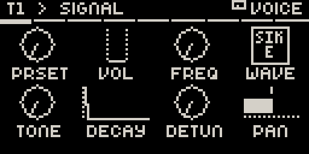

*Forge* takes it further: its **16 pads are a Kit A↔B performance grid** (lower
two rows = Kit A, upper two = Kit B; the *Morph* knob crossfades them), and
tapping any pad selects that voice for deep editing across six pages —
**Osc, Filter, Env, Mod, Setup, Send**:

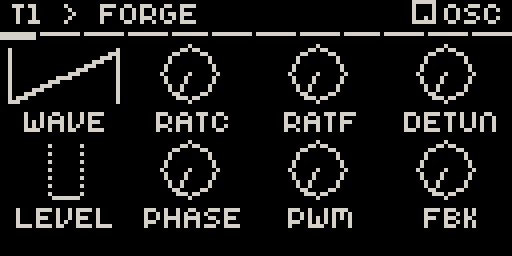

The **Send** page holds the selected voice's mixer strip — **Reverb Send**,
**Delay Send** and **Pan**. On Kit A pads these are automatable like any other
per-voice parameter (classic per-step delay throws); Kit B pads can still be
edited, just not automated:

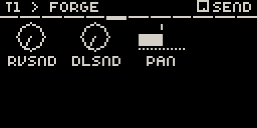

*Libpo32* (a PO-32 / Microtonic-style engine) gives all **16 voices** the same
treatment across **Osc, Mod, Noise and Voice** pages: pitch, decay, noise mix,
distortion and level are per-voice automatable, and the Noise page draws the
noise filter's response curve. Each voice is addressed by a fixed index, so
per-voice automation is playback-safe regardless of which pad last played.

Because there's no other way to choose a drum type on the device, drum modules
rely on Movy's **layout templates**. Mr Drums, Weird Dreams, KrautDrums and
Signal ship Movy templates; Forge and Libpo32 are **self-describing** — they
carry their own layout in the module. Other drum modules may need one
contributed (see [CONTRIBUTING.md](CONTRIBUTING.md)).

---

## 5. The sequencer (aligned with Move)

Movy's sequencer is built to **feel like Move's**, for four Schwung tracks. The
following all work essentially as they do on Move — refer to the
[Move manual](https://cdn-resources.ableton.com/resources/pdfs/move-manual/1/2024-10-04/move1-manual-en.pdf)
for the concepts:

- **Clips** — one clip per track slot; steps entered on the 16 step buttons.
- **Session view & clip launching** — press **Note/Session** to see the clip
  grid; pads launch clips. Hold it for a momentary peek; tap to latch.
- **Live recording** — **Rec** arms recording with a one-bar **count-in**; play
  the pads to record. Clips start only after the count-in. A note played
  slightly *ahead* of the final beat still lands on the downbeat rather than
  being dropped, so leaning into the first hit does not cost you the note.
- **Metronome** — toggle with **Shift + Step 6**.
- **Step recording** — hold **Rec** while stopped and play the pads to enter
  notes one step at a time; see [Step recording](#step-recording) below.
- **Capture** — play first, keep it after: see
  [Capture](#capture--keep-what-you-just-played) below.
- **Step entry & editing** — tap a step to toggle a note; **hold a step** to edit
  it (and to open its [step parameters](#6-beyond-move-step-clip--set-parameters)).
- **Note length** — **hold step A, then press step B** to set A's length up to B.
- **Loop / bars** — the **Loop** button shows the bar overview; **Left/Right**
  navigate bars. **Shift + Step 15** doubles the loop.
- **Duplicate / delete** — **Copy** and **Delete** (a.k.a. Clear) act on steps,
  clips, or bars depending on context. **Hold Clear + a drum pad** wipes that
  pad from the whole clip — one lane emptied without touching the others,
  wherever its notes fall. A pad that plays nothing (outside the drum grid, or
  a gap in a piano layout) clears nothing.
- **Quantize** — **Shift + Step 16**. See [Quantization](#quantization).
- **Mute** — press **Mute** on its own to mute the current track; or hold
  **Mute** and press a track button to mute that one instead. Using the
  track-button form suppresses the current-track toggle, so one press never
  mutes two things. In Session view there is no current track, so Mute stays a
  pure modifier there.
- **Solo** — the same two gestures with **Shift**: **Shift + Mute** solos the
  current track, **Shift + Mute + track button** solos that one. Press again to
  un-solo. Solo is **exclusive** — soloing another track moves the solo rather
  than adding to it. **Solo overrides mute**,
  so soloing a track you had muted makes it audible; your own mutes are
  remembered underneath and put back exactly as they were when the last solo
  drops. Solo works by muting everything else, so it silences their *sequenced
  notes* — pads you play by hand on a silenced track still sound. Silenced
  tracks dim their track button like muted ones, and every mute or solo shows a
  toast naming the track (and the whole solo set, e.g. `SOLO T1 T3`). Shift can
  go down before or after Mute — either order works.
- **Automation** — turn a module knob while recording (or while holding a step)
  to record parameter automation; the on-screen knob arc follows the automation.

  

Because Movy keeps the module's parameters on screen during sequencing, some of
Move's full-screen sequencer displays are replaced by **LED feedback on the pads
and step buttons** plus a bar/position indicator and brief on-screen
announcements. The lighting follows Move's conventions (play = green, record =
red, only actionable buttons lit, the playhead sweeps the step row, etc.).

> **Note:** Movy's sequencer intentionally does **not** copy Davebox's timing
> where Davebox deviates from Move — the goal is to match native Move.

### Quantization

Quantization in Movy is a **value, not an action**. Every clip carries a
strength from 0 to 100 %, applied as notes are played rather than by rewriting
them, so the timing you recorded is never destroyed and you can dial it back at
any time.

- **0 %** — the take plays exactly as you played it.
- **100 %** — every note lands dead on the step grid.
- In between, notes are pulled toward the grid by that fraction. 60–80 % tightens
  a take without flattening the feel out of it.

**Shift + Step 16** cycles the current clip through **0 % → the set default →
100 %**, and shows the choices for a moment. `DEF` marks the default:


While the panel is up the **jog** picks between the same values, and **Back**
closes it. Playing pads or entering steps does not disturb it. When the default
is already 0 or 100 there are only two values to cycle.

For anything other than those three, **QUANT** on the
[Clip page](#clip-parameters--shift--step-3) sets the clip directly:

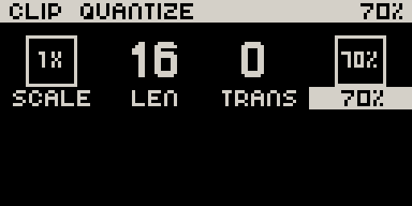

**QUANT** on the [Set page](#set-parameters--shift--step-5--7--9) sets the
**default** — the strength new clips are created with, so a take you record gets
your preferred tightness immediately. Changing it never re-times clips that
already exist; each clip owns its own value from the moment it is created.

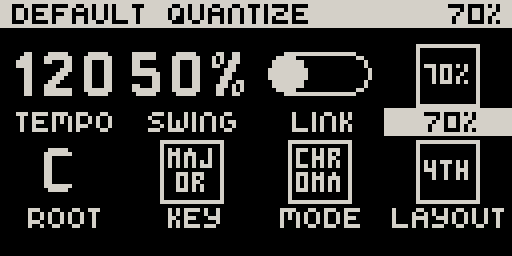

The default follows you into **new sets**, so it is a preference you set once
rather than per project. Clips from sets made before this existed load at 0 %,
so an older set sounds exactly as it always did.

Notes entered on the step buttons are already on the grid, so quantization has
no effect on programmed patterns — only on what you play in. **Swing is
independent**: it applies at full strength whatever the quantization is.

### Step recording

Hold **Rec** while the transport is stopped and play the pads: each note lands
on the record head and the head moves on. Nothing is timed, so a phrase you
could never play in real time goes in as fast as you can find the notes. It
works the same on melodic and drum tracks.

Notes that overlap land on the **same step** — hold a chord and it is entered as
a chord; the head only advances when the last finger lifts. Tap notes one at a
time and each gets its own step.

While Rec is held:

| Control | Action |
| --- | --- |
| **Pads** | Enter notes at the head. |
| **Right** | Leave a rest — or, with pads held, **tie** the chord into the next step. |
| **Left** | Step back: the note there plays and its pads light, ready to be replaced. With pads held, **untie**. |
| **Step button** | Jump the head there; if that step had notes, it is cleared. |
| **Release Rec** | Done. |

The head blinks red on the step row and the screen shows the position and the
notes under it, with the module's parameters still visible underneath — so you
can keep tweaking the sound while you enter the part. The **Left/Right arrows
blink** while they are worth pressing: Right always, Left once there is a step
to go back to or a tie to undo.


On an **empty clip** the clip grows to exactly what you play, one step at a
time, rests included — play seven notes and you get a seven-step clip. On a clip
that already has notes the head **wraps** at the end and overwrites, leaving the
length alone.

Entering notes **replaces** what is on the step on a melodic track, so stepping
back and replaying overwrites cleanly. On a drum track pads only **add** their
own lane, so you can lay the kick down in one pass and the snare in the next.

A quick **tap** of Rec still arms live recording as before — only holding it
starts step recording.

### Capture — keep what you just played

Movy is always listening. Everything you play on the pads while that track
isn't recording goes into a buffer, so when something comes out right you can
keep it after the fact: press **Capture**. The Capture button is lit whenever
there is something buffered worth keeping.

Capture writes into the **current track's current clip**. What happens depends
on the transport:

| Transport | Clip | What you get |
| --- | --- | --- |
| Playing | empty | The phrase you just played, keeping the tempo and the beat you played it on, with the clip grown to whole bars around it. It falls in **on the bar**, like any other clip launch, so it lines up with your other tracks. |
| Playing | has notes | An overdub: each note lands where you heard it, and the clip keeps its length. |
| Stopped | empty | A new take — Movy reads a tempo off your playing, sizes the clip, and starts the transport so you hear it at once. With no transport running there is no beat to hold on to, so here the first note you played *is* the start of the clip. |
| Stopped | has notes | The take is fitted to the tempo you already have (see below). |

After a **stopped** capture the screen shows what happened and stays until you
press something:


Three tempos, the applied one boxed. **Turn the jog** to take another — it is
applied as you pass it, and the transport keeps rolling, so you can hear which
one fits. The bar count in the corner follows: the same performance is more bars
at a faster tempo, and it always plays back at the speed you played it. **Any
button, pad or knob closes the overlay.**

When the tempo isn't Movy's to set — because Move is clocking us, or because
you captured into a clip that already has notes — there is nothing to choose,
and the overlay explains the fit instead:

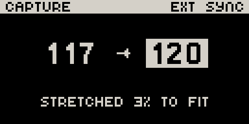

Movy still reads a tempo off your playing, then stretches the take onto the
tempo you have. It picks whichever reading is closest, including half and double
time, so the stretch is always the smallest one available — a phrase played at
58 BPM against a 120 BPM set is fitted through 116, not doubled.

**What clears the buffer.** Capture keeps what you played while you were *just
playing*, so anything that means you have moved on empties it — the Capture
button goes dark when it does:

- **Play or Stop**, and **pressing a track button**.
- **Playing over a spot you already covered**, once the loop has come round —
  that means you are redoing that part, so the earlier pass goes and Capture
  takes the one you just played. Notes that land somewhere new keep
  accumulating, so a phrase that runs across the loop end stays whole.
- **Any deliberate edit** — arming Rec, entering or editing steps, changing the
  clip length or loop, launching or deleting a clip, editing automation.
- **Switching to Session.**
- **Time**: a couple of bars of silence, and in any case only the last
  **8 bars** of playing are ever kept. Without that ceiling, playing without
  pausing for a minute would capture the whole minute.

To throw it away by hand, hold **Clear** and press **Capture**.

> **Not Shift + Capture.** Move clears the input that way, but on Schwung that
> combo belongs to the skip-back recorder and never reaches Movy — you would see
> "skipback saved" and the buffer would still be full. Hold **Clear** instead.

> **Not captured:** knob moves. Move captures automation too; Movy captures
> notes only. Record automation live instead (see the sequencer list above).

### Saving — there is no Save button

Movy saves by itself, and there is deliberately nothing to press. Your
sequence, tempo, swing, automation and the Set-page settings (tonic, scale,
mode, layout, per-track octave, mutes) are stored **per Move set**, so every set
recalls its own Movy project. Switch sets on Move and Movy follows.

Saving happens a few seconds after you stop changing things, when you switch to
another set, and when you close Movy — so leaving immediately after an edit
keeps it. Nothing is written when nothing has changed.

Each set keeps a couple of rotating backup copies of its sequence alongside the
main file. If the Move loses power or a crash interrupts a save, Movy detects
the damaged file on the next load and falls back to the newest intact copy
rather than opening a blank template. Sets saved by older Movy versions load
normally.

Movy stores only sequencer data. Which instrument is on each track and how it's
set up belongs to Schwung and the Move set, and is saved by them.

### Background mode — keep playing under Move's UI

Movy can drop into the background and keep sequencing while you use Move's own
screens (Session, Note, the mixer, etc.). Because the sequencer engine and its
clock keep running, tempo-synced LFOs stay phase-locked the whole time.

Pressing **Back** at the **root** view (the chain page) opens a **Leave Movy**
menu — it does *not* leave instantly, so you can't drop into the background by
accident:

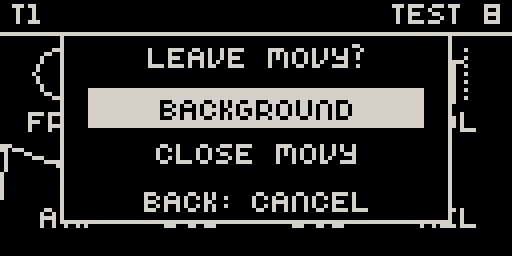

- **Background** (highlighted by default) — jog-**click** to park Movy: the
  screen returns to Move but Movy keeps playing. So backgrounding is **Back then
  jog-click**. Held pad notes are released when the menu opens so nothing hangs.
- **Close Movy** — jog-**turn** to it, then jog-click, to fully unload Movy.
- **Back** again **cancels** and returns you to Movy.

(Back still steps *backwards* through Movy's own sub-views — the browser,
keyboard/knob pages, the master-FX detail, and the Step/Clip/Set pages — as
usual; the menu only appears when you press Back at the root.)

- **Return from background:** reopen Movy from the Tools menu (or the last-tool
  shortcut). The screen and LEDs repaint from the current state; the sequence
  never stopped.
- **Fully exit instantly:** **Shift + Back**, from anywhere, unloads Movy
  without the menu.

> **Host requirement:** the Background option needs a Schwung host that supports
> self-managed suspend. On an older host the menu shows **Close Movy** only.

### Syncing with Move's sequencer

Turn on **LINK** (the Set page's fifth cell — knob 4; **OFF** by default) and
Movy and Move share **one transport**: press Play (or Stop) on **either** and
both start (or stop) together, making Movy four extra tracks of your Move set.
This is what makes background mode musical: run Move's sequencer and Movy rides
along, locked. The setting is saved with each set.

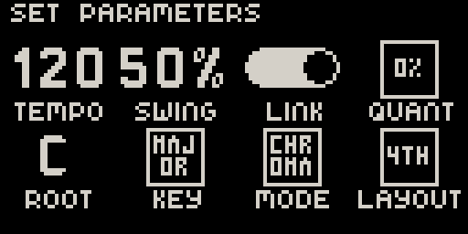

With **LINK on**:

- **Play in Move** starts Movy too (even while Movy is parked in the
  background); **Stop in Move** stops it.
- **Play in Movy** starts Move too. Because Move aligns its start to the Link
  bar grid, Movy waits — silently — up to about a bar for Move's downbeat, then
  both begin the bar together. (If Move never answers within ~2 bars, Movy
  starts on its own clock anyway.) **Stop in Movy** stops Move.

With **LINK off** (the default) each transport is independent — Movy's Play/Stop
never touches Move's, and Move's never starts or stops Movy. The tempo/grid
locking below still happens automatically whenever both are playing, LINK or not.

While both run, they lock as one grid:

- Movy rides Move's clock, so both grids stay **drift-free** — their downbeats
  line up and stay lined up. The Set page's **TEMPO** cell shows **EXT** and
  displays Move's tempo:

  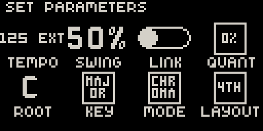

- Pressing **Play in Move** re-anchors Movy to the bar — Movy restarts its
  pattern so both start the bar together.
- **Change Move's tempo** (from Move's screen) and Movy follows within about a
  second; the notes stay locked.
- **Turn Movy's TEMPO knob** and Move's tempo changes to match — Movy writes the
  device-wide tempo, and both stay locked. (The display may rubber-band briefly
  as the two converge — that's normal.)
- If Move's clock simply **drops out** (a glitch, not a Stop), Movy keeps
  playing at the captured tempo on its own clock; within a bar the synced LFOs
  re-lock to Movy's grid.

**Working with one transport (LINK on):** for **Movy-only** playback, keep the
native Move set silent (no clips playing). For **Move-only** playback, stop or
mute Movy's four tracks individually. (The link propagates the Play/Stop
*buttons*; launching a Session clip does not reach across to Move.)

> **Tempo & Ableton Link:** Movy's TEMPO knob sets the device tempo through
> Move's Link connection, which only takes effect while Move is the sole Link
> peer. With Ableton Live (or another Link peer) connected, the session owns the
> tempo and Movy's knob won't override it — which is the correct behaviour. It
> also requires schwung's **Link Audio** to be enabled (Global Settings → Audio);
> with Link Audio off the knob can't reach Move's tempo, so set the tempo from
> Move instead. (Move → Movy tempo follow is unaffected — it always works.) See
> [docs/tempo-knob-move-override-not-applied.md](docs/tempo-knob-move-override-not-applied.md)
> for details.

---

## 6. Beyond Move: Step, Clip & Set parameters

These three pages add control Move doesn't expose on-device. Each opens with a
**Shift + Step** combination (or, for step parameters, by holding a step).

### Step parameters — per-trig locks

**Hold a step** that has a note. While held, **page 0** becomes the **Step**
page, showing that trig's intrinsic properties on the knobs:


| Knob | Parameter | Notes |
| --- | --- | --- |
| 1 | **VEL** | Velocity for this trig. |
| 2 | **LEN** | Note length. |
| 3 | **PROB** | Probability the trig fires (0–100%). |
| 4 | **COND** | Trig condition (e.g. `2:3` = fire on the 2nd of every 3 cycles). |
| 5 | **INV** | Invert — flips the condition. |

This is Movy's take on Elektron-style **parameter locks**: a per-step,
per-parameter override. (While a step is held, jog/Left/Right can still roam the
module pages so a single held step can automate across the chain.)

### Clip parameters — Shift + Step 3

In Track view, **Shift + Step 3** opens the **Clip** page for the active clip:

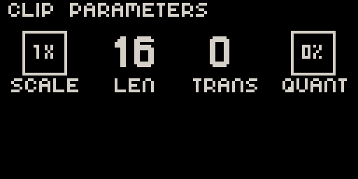

| Knob | Parameter |
| --- | --- |
| 1 | **SCALE** — the clip's musical scale. |
| 2 | **LEN** — clip length in steps. |
| 3 | **TRANS** — transpose. Reads `n/a` on a drum track (see below). |
| 4 | **QUANT** — [quantization strength](#quantization) for this clip, 0–100 %. |

(Clip parameters apply to a single clip, so this page is Track-view only.)

On a **drum track**, transpose is unavailable — the cell reads `n/a` and the knob
does nothing:

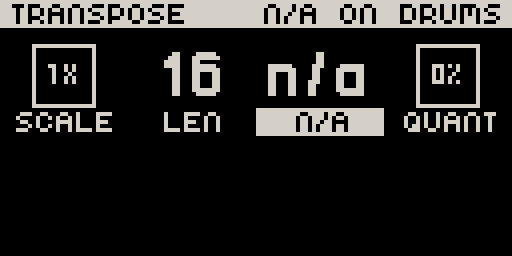

A drum module's pitches are pad addresses, not notes, so shifting them fires a
different pad — or, if the shift lands outside the module's pad range, nothing at
all. The sequencer ignores clip transpose on those tracks, including for a clip
that already carried one from before a drum module was loaded onto the track.

### Set parameters — Shift + Step 5 / 7 / 9

**Shift + Step 5, 7, or 9** opens the global **Set** page:


| Knob | Parameter |
| --- | --- |
| 1 | **TEMPO** |
| 2 | **SWING** |
| 3 | **LINK** — Play/Stop propagation to Move |
| 4 | **QUANT** — the [quantization](#quantization) new clips are created with |
| 5 | **ROOT** — the tonic's pitch class |
| 6 | **KEY** — scale |
| 7 | **MODE** — Chromatic or In Key |
| 8 | **LAYOUT** — the pad grid's shape |

KEY, MODE and LAYOUT each open a scrollable list (the same enum overlay used
elsewhere):

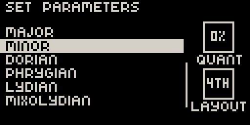
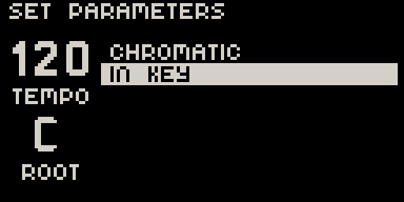

MODE and LAYOUT are covered in [Pad layouts](#pad-layouts).

These are set-wide (they affect all tracks). **TEMPO** also sets Move's
device-wide tempo through Ableton Link, so a following Move tracks the knob;
the cell shows **EXT** while Movy is locked to Move's transport (see
[Syncing with Move's sequencer](#syncing-with-moves-sequencer)).

Press **Back** (or a track button) to close any of these pages and return to
where you were.

---

## 6a. Undo & redo

Press **Undo** to take back the last edit; **Shift + Undo** redoes it. An
overlay names what changed, where, and which way — the value on the right of
the arrow is what it is *now*, so the same reading works for both:

    UNDO                    REDO
    CUTOFF                  CUTOFF
    T1: 0.31 -> 0.42        T1: 0.42 -> 0.31


**What's undoable.** Everything that changes the music: notes and steps, clip
clear / delete / copy / paste / duplicate, clip scale, length and transpose
(each its own undo, committed when you let the knob go), loop length and start, per-step trig
properties, automation (locks, lane values, clearing a lane or a step),
tempo, swing, root and key, track mute, solo and volume, synth and LFO
parameters,
LFO assignments, and module or preset loads.

**What isn't.** Anything that only changes what you're looking at — selecting a
track or clip, moving between bars or pages, Session mode, the browser — plus
Play, Rec, the metronome, **LINK**, and the keyboard layout. Undo is for edits,
not for navigation or performance.

**How edits are grouped.** One gesture is one undo, not one undo per detent:

- Turning a knob is a single entry however far you turn it, from where the knob
  started to where you let go.
- Each pass of live recording is its own entry — record over two loops and it
  takes two presses to remove both.
- Everything else — a step press, a clear, a paste — is one entry each.

An edit that changes nothing costs no press: turn a knob up and back down
before releasing it and there is nothing to undo.

Undoing a module load brings the old module back **with its settings**, taken
from the module's own saved state — the same snapshot Schwung uses for its
module presets. Adding and removing a module are undoable the same way.

Changing a **preset** is undone the same way, so tweaks you made after loading
it are not lost: undoing returns the module exactly as it was, rather than
re-applying the old preset from scratch. Redoing picks the preset again, which
is what you did the first time.

**What Undo can't reach.** Worth knowing before you rely on it:

- **Octave** (the +/- buttons) isn't undoable — it's treated as a live
  performance control. Root, scale, mute and solo all are.
- **Parameters something else is driving** — one with an automation lane, or one
  a track LFO is modulating — are left out of a module restore. Their on-screen
  value belongs to Movy and the sounding value belongs to the engine, so there
  is no single number to put back. Undo restores everything around them.
- **A module's hidden state.** Undoing a module load restores what the module
  itself reports; anything it doesn't publish — a sample's contents, a parameter
  absent from its list — can't come back.
- **Parameters the module derives** rather than stores will not hold a restored
  value. Movy rewrites them a few times and then leaves them.
- **Nothing outside Movy.** Edits made in Move's own UI while Movy is parked in
  the background are invisible to it. If a module changed underneath, Movy drops
  its history rather than apply it to the wrong thing, and says so.
- **The oldest edits fall off.** History holds 64 entries (and a memory budget);
  past that the oldest are discarded, and undoing that far back does nothing.
- **A no-op costs nothing.** Quantising an already-quantised clip, or a knob
  turned back to where it started, records no entry — so Undo will name the edit
  before it. That's deliberate.

**Limits.** History lives in memory and is cleared when you switch sets or
close Movy. It holds the last 64 edits. Undoing a module load restores the old
module and its parameters, but anything Movy never sees — a loaded sample's
contents, a parameter the module doesn't publish — can't come back. If a module
is changed outside Movy while it's parked in the background, the history is
dropped rather than applied to the wrong thing, and the overlay says so.

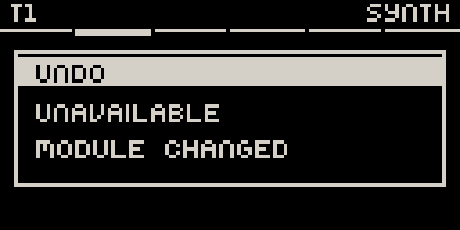

---

## 7. Limitations vs Move

Movy aims to match Move, but it's an early prototype and several things are
missing or simplified. **All of these are candidates for future work — and
[contributions are welcome](CONTRIBUTING.md).**

- **No automation capture.** [Capture](#capture--keep-what-you-just-played)
  keeps notes; knob moves made before you press it are not captured. Record
  automation live instead.
- **Four Schwung tracks only.** Movy sequences four Schwung chains — not Move's
  native instruments, drum racks, or sampler.
- **Simplified clip model.** Sequencer resolution and some clip-level features
  are reduced compared to Move.
- **Rough edges.** Expect occasional display glitches or, rarely, a crash that
  needs a [recovery](#9-troubleshooting--recovery).

If a missing feature matters to you, please open an issue describing the Move
behaviour you'd like — or, better, a PR.

---

## 8. Controls reference

### Parameter / chain views

| Control | Action |
| --- | --- |
| **Knobs 1–8** | Edit the current page's parameters. Touch (no turn) shows the exact value. |
| **Turn an action knob clockwise** | Fire a one-shot action (Capture, Reroll, …) once per turn, however far you keep turning. The circle blinks and the knob LED flashes. |
| **Turn an action knob counter-clockwise** | Re-arm it immediately instead of waiting for the drain bar to run out. |
| **Hold a knob (~1 s)** | Assign that parameter as an **LFO target**: jog picks LFO 1/2, jog-click assigns (hold again to remove). Automatable parameters only. |
| **Jog wheel — turn** | Scroll chain slots (Chain view) or module pages (Knobs view) / browser list. On the LFO page, scroll between LFO 1 and LFO 2. |
| **Jog wheel — click** | Drill Chain → module pages; on Knobs (or an empty slot) open the module browser; in a browser, load the selection. |
| **Shift + jog wheel — turn** | Knobs view: jump to the previous/next **section**, skipping that section's overflow pages. |
| **Hold the jog (~1 s)** | Touch without turning: a bottom prompt spells out what a click does on this page. A turn or release clears it. |
| **Shift + jog click** | Open the module browser to swap the current slot's module. |
| **Back** | Module pages → Chain; browser → cancel; **at the root (Chain) → open the Leave Movy menu** (Background / Close Movy). |
| **Back then jog-click** | From the root: background Movy (keeps playing under Move's UI). |
| **Shift + Back** | Fully exit Movy (unload), instantly, from anywhere. |
| **Hold track + volume encoder** | Set that track's volume (0–400%, 100% = unity, 1 dB per detent). Add **Shift** to see Movy's slider instead of Move's native overlay. |
| **+ / −** (Up/Down) | Shift the **active track's** octave (melodic tracks only). Each track remembers its own, saved with the set. |

### Sequencer

| Control | Action |
| --- | --- |
| **Step buttons 1–16** | Toggle a note on/off at that step. |
| **Hold a step** | Edit that step; opens its **Step parameters** (page 0). |
| **Hold step A + press step B** | Set step A's note length up to B. |
| **Hold a step + pad** | Edit that step's notes from the keyboard. |
| **Play** | Start / stop the transport. When **LINK** is on, also starts / stops Move's native sequencer (a Movy-initiated start waits ~1 bar for Move's Link grid). |
| **Rec** (tap) | Arm recording (one-bar count-in). |
| **Hold Rec** (stopped) | **Step recording** — play the pads to enter notes step by step. |
| **Hold Rec + pads** | Enter a note or chord at the head; the head advances when the last pad lifts. |
| **Hold Rec + Right / Left** | Rest / step back — or tie / untie the chord being held. |
| **Hold Rec + step button** | Jump the head to that step, clearing it if it had notes. |
| **Capture** | Keep the notes you just played as clip data. Stopped → also reads a tempo and starts the transport. |
| **Clear + Capture** | Throw the buffered input away. (Not Shift + Capture — that belongs to schwung's skip-back and never reaches Movy.) |
| **Jog** (capture overlay) | Take another tempo — applied as you pass it. Any other press closes the overlay. |
| **Note / Session** | Show the Session clip grid (momentary hold = peek, tap = latch). Pads launch clips. |
| **Loop** | Toggle the bar/loop overview; hold + jog resizes the loop. |
| **Left / Right** | Navigate bars (or nudge held steps). |
| **Copy** | Duplicate a step / clip / bar (context-dependent). |
| **Delete (Clear)** | Delete a step / clip / bar; in Session, delete a clip. Hold + knob-touch clears that knob's automation lane. |
| **Hold Clear + pad** | Clear every note of that pad's pitch from the clip — a whole drum lane at once. |
| **Undo** | Undo the last edit. |
| **Shift + Undo** | Redo it. |
| **Mute** | Mute / unmute the current track (Track view only — Session view has no current track). |
| **Mute + track** | Mute that track instead; suppresses the current-track toggle on release. |
| **Shift + Mute** | Solo / un-solo the current track (Track view only). Exclusive — soloing another moves it. |
| **Shift + Mute + track** | Solo that track instead. |
| **Track buttons 1–4** | Select a track (hold = momentary peek). |
| **Volume encoder** | Adjust held steps' velocity. With a track button held instead, sets that track's volume; otherwise it stays Move's master volume. |
| **TEMPO knob** (Set page) | Set the tempo; also sets Move's device-wide tempo via Link. **EXT** on the cell = locked to Move's transport. |
| **LINK knob** (Set page) | Turn right = ON, left = OFF. Enables the shared Play/Stop transport with Move (default OFF; saved per set). Clock/tempo follow works regardless. |

### Shift + Step shortcuts

| Combo | Action |
| --- | --- |
| **Shift + Step 3** | Open **Clip parameters** (Track view). |
| **Shift + Step 5 / 7 / 9** | Open **Set parameters** (tempo/swing/link, root/key/mode/layout). |
| **Shift + Step 6** | Toggle the **metronome**. |
| **Shift + Step 10** | Toggle **full velocity**. |
| **Shift + Step 15** | **Double** the loop. |
| **Shift + Step 16** | Cycle the current clip's **quantization** (0 / default / 100 %). |

---

## 9. Troubleshooting & recovery

- **Movy looks frozen or the screen is stale.** Press **Back** to leave and
  re-open Movy from the Tools menu. Movy keeps running in the background; on most
  Schwung builds you can re-enter by holding **Shift + Step 13**.
- **A set opens as a blank template.** Movy keeps rotating backup copies and
  falls back to the newest intact one, so this should no longer follow a freeze
  or a power-cut. If it still happens, the set's files are under
  `schwung/modules/tools/movy/sets/<set-uuid>/` — `seq-state.json` plus
  `seq-state.1.json` / `seq-state.2.json`. Attach all of them to a bug report;
  each carries a generation number, which says which was written last.
- **The audio engine (MoveOriginal) crashed.** A sequencer engine bug should be
  caught before it can take down Move, but if audio dies, a full restart of the
  Schwung stack recovers it (see the build/test notes in
  [CONTRIBUTING.md](CONTRIBUTING.md) / the project's developer docs).
- **A module's parameters look wrong or empty.** It may need a layout template.
  Note the module and open an issue (or contribute a template).

### Reporting bugs

Movy is a prototype, so good bug reports really help. Please include:

1. **What you did** — a numbered list of steps.
2. **What you expected** to happen.
3. **What actually happened.**
4. **Which modules** were loaded in the chain (and on which track).
5. Anything from the device log if you can grab it.

A reproducible report (steps that reliably trigger the problem) is worth far
more than a screenshot of a broken screen. Thank you! 🙏
