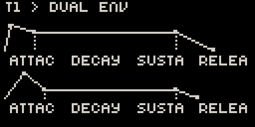
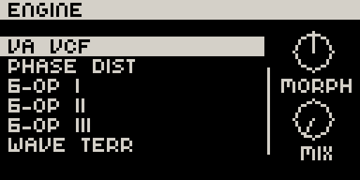
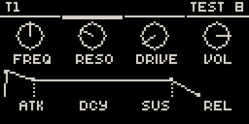
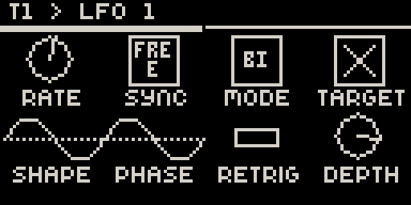
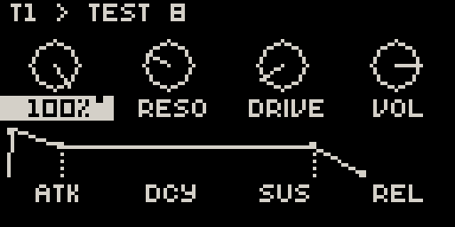
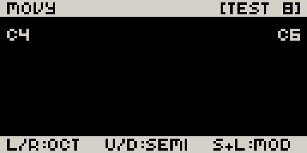
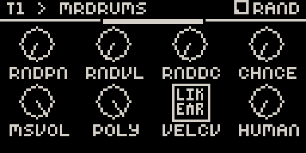
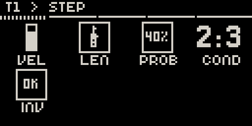

# Movy

**A friendly, Elektron-style knob UI and 4-track step sequencer for [Ableton Move](https://www.ableton.com/move/), built on the [Schwung](https://github.com/charlesvestal/schwung) framework.**

Movy turns Move into a hands-on instrument for Schwung modules: every module's
parameters land on the 8 knobs as clean, readable pages, and a 4-track
sequencer — modelled closely on Move's own — sits underneath, driven by a small
Rust engine.


<sub>A tour of Movy's screens — a montage of UI states, not a live capture.</sub>

> ### ⚠️ Early prototype
>
> Movy is an **early, experimental prototype** — a proof of concept that has
> grown a lot of features but is not a finished product. It works on real
> hardware and is tested end-to-end, but expect rough edges, missing pieces, and
> the occasional crash.
>
> **I can't promise this will ever be "finished."** That said:
>
> - **Contributions are very welcome** — see [CONTRIBUTING.md](CONTRIBUTING.md).
> - **Bug reports are welcome too** — please make them **reproducible** (what you
>   did, what you expected, what happened, which modules were loaded). A vague
>   "it crashed" is hard to act on; a numbered list of steps is gold.
>
> 📖 **Full guide: [MANUAL.md](MANUAL.md)** · 📜 **[Changelog](CHANGELOG.md)**

---

## What is Movy?

Move is a wonderful piece of hardware, and [Schwung](https://github.com/charlesvestal/schwung)
opens it up to run custom DSP modules (synths, drums, effects). But controlling
those modules and sequencing them on the device itself is bare-bones. Movy fills
that gap with two things:

1. **A parameter UI** — pick up any Schwung module and its parameters are laid
   out on the 8 knobs as tidy pages, with arc knobs, enum lists, and even
   auto-detected ADSR envelope graphics. Walk the whole chain (MIDI FX → Synth →
   FX 1 → FX 2 → LFO) with the jog wheel.
2. **A sequencer** — a 4-track step sequencer whose behaviour is aligned as
   closely as possible with Move's native sequencer (clips, session view, live +
   step recording, automation), but driving four Schwung tracks instead of
   Move's instruments.

## Inspiration & lineage

Movy stands on the shoulders of several projects:

| Aspect | Inspired by |
| --- | --- |
| **Screen UI** | [Elektron](https://www.elektron.se/) boxes (knob pages, parameter locks), with a nod to [Dronage](https://github.com/charlesvestal/schwung) |
| **Sequencer behaviour** | Ableton **Move**'s native sequencer — Movy tries to feel the same, just for 4 Schwung tracks |
| **Sequencer architecture** | [Davebox](https://github.com/legsmechanical/schwung-davebox) — the proven engine/transport approach (without copying its code, and without inheriting its deviations from native Move) |
| **Concept** | Native Move + Davebox + Dronage, distilled into one tool |

## Features

- **Parameter pages for any module** — knobs, arc knobs, scrollable enum
  overlays, and auto-detected ADSR **envelope graphics** instead of four
  separate knobs.

  
  

- **Full chain navigation** — MIDI FX, Synth, FX 1, FX 2 per track, plus a
  master FX chain in Session view.

  

- **Per-track LFOs** — two LFOs per track with a live waveform display
  (shape, rate/sync, depth, phase, retrigger). **Hold any knob** to modulate
  that parameter with an LFO; modulated params are marked with a `~`.

  

- **4-track sequencer**, aligned with Move: clips, Session view & clip
  launching, live recording (with count-in/metronome), step entry, loop/bar
  editing, duplicate/delete, and **parameter automation**.

  

- **Chromatic keyboard** — the 32 pads become a two-octave chromatic keyboard,
  per track, with octave shifting.

  

- **Drum support** — drum modules switch the pads to a 4×4 rack with per-pad
  parameter pages.

  

- **Beyond Move** — three pages of features Move doesn't have on-device:
  - **Step parameters** — per-trig velocity, length, probability, condition, invert.
  - **Clip parameters** — scale, length, transpose.
  - **Set parameters** — tempo, swing, root, key.

  

- **Background mode** — Back at the root opens a Leave menu; choose Background
  to keep Movy sequencing under Move's own screens (synced LFOs stay locked).
  Shift + Back exits instantly.
- **Syncs with Move's sequencer** — play Move's native sequencer and Movy
  automatically locks to its transport (drift-free), follows its tempo, and
  shares tempo back through the TEMPO knob.

See the [manual](MANUAL.md) for how each of these works.

## Module support

Movy works with **most Schwung modules with no setup at all** — it reads each
module's parameter hierarchy and lays it out automatically.

Some modules use a **built-in layout template** for a nicer arrangement. These
are especially important for **drums**, where there is otherwise no way to switch
the drum type from the device. Templates currently ship inside Movy; in the
future, layouts should ideally be read from the module itself.

**Tested drum modules:**

- [Mr Drums](https://github.com/handcraftedcc/schwung-mrdrums) — basic drums
- [Weird Dreams](https://github.com/filliformes/weird-dreams-move) — synth drums

Other modules will work via the generic layout; if a module deserves a custom
template (or you want to improve drum support), **contributions are welcome** —
see [CONTRIBUTING.md](CONTRIBUTING.md).

## Requirements

- An **Ableton Move** with the **[Schwung](https://github.com/charlesvestal/schwung)**
  framework installed.
- At least one Schwung sound-generator module to play.

## Install

Movy is a Schwung **tool module**. Build and deploy it to a Move reachable at
`move.local`:

```bash
cd movy
npm install
./scripts/deploy.sh            # builds ui.js + the Rust engine (dsp.so), deploys both
```

Then open **Movy** from Schwung's Tools menu on the device. See
[CONTRIBUTING.md](CONTRIBUTING.md) for the full build/test workflow.

## Limitations

Movy intentionally tracks Move's behaviour, but it is **not** a full
reimplementation. Notable gaps (all candidates for future work — contributions
welcome):

- **No undo.**
- **No capture** (Move's "play it, then capture it retroactively").
- **Chromatic keyboard only** — no scale-aware pad layouts (Move's *In Key* /
  in-scale, or the guitar-style in-scale layout).
- Sequencer **resolution and some clip-level features** are simplified.

A fuller list, with context, is in the [manual](MANUAL.md#limitations-vs-move).

## Contributing & bug reports

Movy is open to contributions and bug reports. Please read
[CONTRIBUTING.md](CONTRIBUTING.md) first — it covers the build/test loop, how to
add a module layout template, and what makes a bug report actionable.

## License

[MIT](LICENSE) © megadake
