# Movy

**A friendly, Elektron-style knob UI and 16-track step sequencer for [Ableton Move](https://www.ableton.com/move/), built on the [Schwung](https://github.com/charlesvestal/schwung) framework.**

Movy turns Move into a hands-on instrument for Schwung modules: every module's
parameters land on the 8 knobs as clean, readable pages, and a 16-track
sequencer — modelled closely on Move's own — sits underneath, driven by a small
Rust engine. Four of those tracks are Schwung's own; the other twelve are chains
Movy hosts itself.

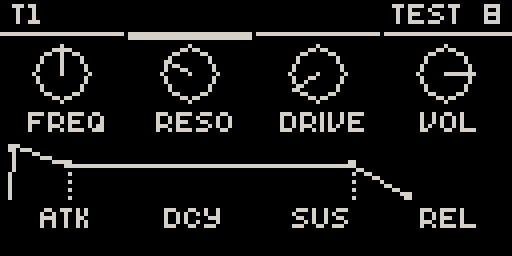

<sub>A tour of Movy's screens — a montage of UI states, not a live capture.</sub>

> ### ⚠️ Early prototype
>
> Movy is an **early, experimental prototype** — a proof of concept that has
> grown a lot of features but is not a finished product. It works on real
> hardware and is tested end-to-end, but expect rough edges, missing pieces, and
> the occasional crash.
>
> **I can't promise this will ever be "finished."** That said:
>
> - **Contributions are very welcome** — see [CONTRIBUTING.md](CONTRIBUTING.md).
> - **Bug reports are welcome too** — please make them **reproducible** (what you
>   did, what you expected, what happened, which modules were loaded). A vague
>   "it crashed" is hard to act on; a numbered list of steps is gold.
>
> 📖 **Full guide: [MANUAL.md](MANUAL.md)** · 📜 **[Changelog](CHANGELOG.md)**

---

## What is Movy?

Move is a wonderful piece of hardware, and [Schwung](https://github.com/charlesvestal/schwung)
opens it up to run custom DSP modules (synths, drums, effects). But controlling
those modules and sequencing them on the device itself is bare-bones. Movy fills
that gap with two things:

1. **A parameter UI** — pick up any Schwung module and its parameters are laid
   out on the 8 knobs as tidy pages, with arc knobs, enum lists, and even
   auto-detected ADSR envelope graphics. Walk the whole chain (MIDI FX → Synth →
   FX 1 → FX 2 → LFO) with the jog wheel.
2. **A sequencer** — a **16-track** step sequencer whose behaviour is aligned as
   closely as possible with Move's native sequencer (clips, session view, live +
   step recording, automation), but driving Schwung tracks instead of Move's
   instruments. Tracks 5-16 host their own module chains inside Movy, summed to
   one stereo output, and a new set puts tracks 1-4 on Movy's chains too — one
   host for all sixteen, and the only way those four join Movy's CPU
   optimization. A setting hands them back to Schwung, per set or for good. The
   16 are arranged as **four groups of four**: in Session view the +/− buttons
   move between groups, and the step buttons pick a track.

## Inspiration & lineage

Movy stands on the shoulders of several projects:

| Aspect | Inspired by |
| --- | --- |
| **Screen UI** | [Elektron](https://www.elektron.se/) boxes (knob pages, parameter locks), with a nod to [Dronage](https://github.com/charlesvestal/schwung) |
| **Sequencer behaviour** | Ableton **Move**'s native sequencer — Movy tries to feel the same, just for 16 Schwung tracks |
| **Sequencer architecture** | [Davebox](https://github.com/legsmechanical/schwung-davebox) — the proven engine/transport approach (without copying its code, and without inheriting its deviations from native Move) |
| **Concept** | Native Move + Davebox + Dronage, distilled into one tool |

## Features

- **Parameter pages for any module** — every section a module publishes, however
  deeply nested (30 pages for Helm, 49 for MiniJV), with knobs, arc knobs,
  scrollable enum overlays, auto-detected ADSR **envelope graphics**, module
  **LFO waveforms**, and **filter-response curves** instead of separate knobs.

  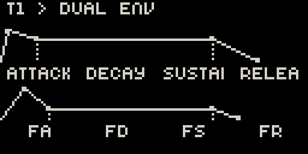
  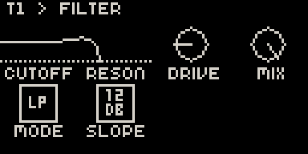
  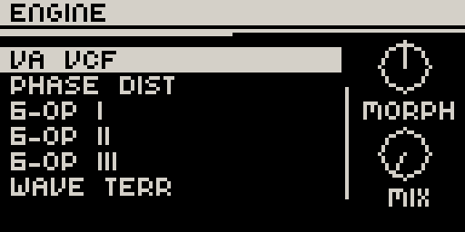

- **Every control drawn as what it is** — waveform selectors draw their wave, a
  sampler draws its sample with the play position, loop and grain spray on it,
  band gains draw an EQ curve, cuts draw the band they leave, levels are faders
  and booleans are switches. All detected from what the module reports.

  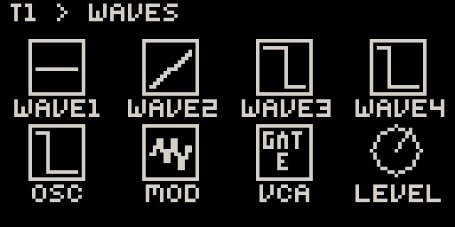
  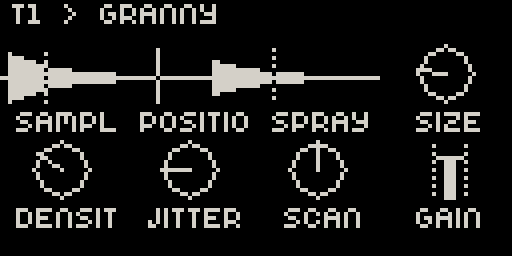
  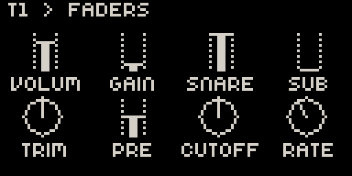
  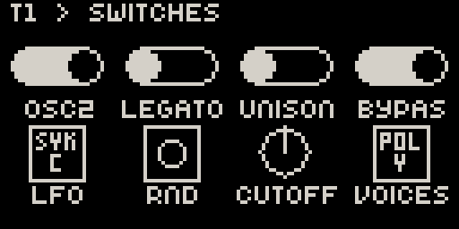

- **Bank & collection selectors** — modules that keep their sounds in
  collections (Dexed's `.syx` banks, OB-Xd's `.fxb` banks, SF2 soundfonts, NAM
  models and cabinets) get a cell beside the preset knob. Touch it to pick;
  nothing loads until you let go.

  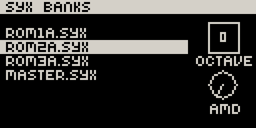

- **Full chain navigation** — MIDI FX, Synth, FX 1, FX 2 per track, plus a
  master FX chain in Session view.

  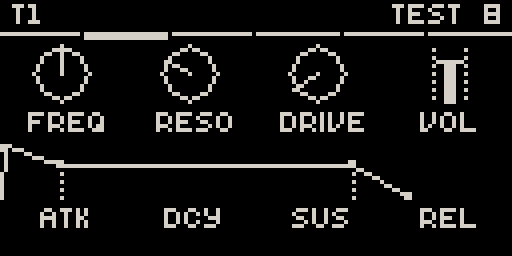

- **Track volume** — hold a track button and turn the volume encoder to set that
  track's level (0–400%, unity marked). Add Shift for Movy's own slider.

  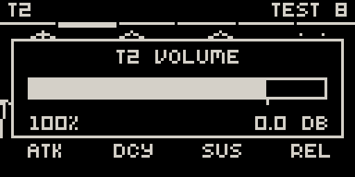

- **Per-track LFOs** — two LFOs per track with a live waveform display
  (shape, rate/sync, depth, phase, retrigger). **Hold any knob** to modulate
  that parameter with an LFO; modulated params are marked with a `~`.

  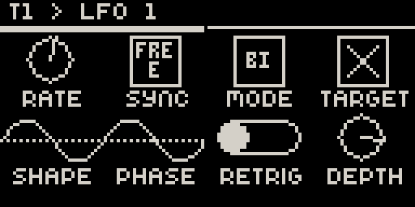

- **16-track sequencer**, aligned with Move: clips, Session view & clip
  launching, live recording (with count-in/metronome), step entry, loop/bar
  editing, duplicate/delete, and **parameter automation**.

  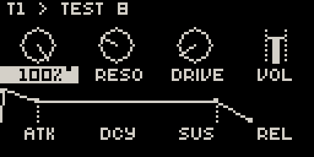

- **Scenes & Song mode** — hold **Shift** in Session view and the step row
  becomes eight **scenes**: each one launches a whole clip column across all 16
  tracks. Keep holding and press more scenes to build a looping **song**. A
  scene plays for as long as its longest clip; press one twice to hold it twice
  as long. The next scene flashes a bar before it lands, the song is saved with
  the set, and launching any clip by hand ends it.

  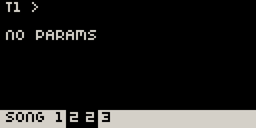

- **Sixteen tracks in four groups.** Tracks 1-4 are the Schwung tracks in a set
  you already have; a new set hands them to Movy instead, which is what lets
  them join the CPU optimization (see **Settings** below). Tracks 5-16 load a module the same way and Movy hosts
  the chain itself, saved with the set. In Session view, **octave +/−** moves between the
  four groups and **a step button selects a track** — or hold **Session** and
  press a step from anywhere. Hold **Mute** anywhere — the pads, Loop mode,
  Session view — and the step row becomes a **16-track mute map**; add **Shift**
  to solo. How many you can actually run is
  a CPU question, not a Movy one: see
  [Limitations](MANUAL.md#7-limitations-vs-move).

- **Step recording** — hold **Rec** while stopped and play notes or chords in
  one step at a time, with ties, rests and back-stepping. An empty clip grows to
  exactly what you play.

  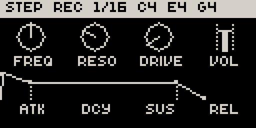

- **Capture** — play freely, then press **Capture** to keep what you just
  played. With the transport stopped it reads a tempo off your playing and
  offers three; the jog picks one and you hear the take at it straight away.

  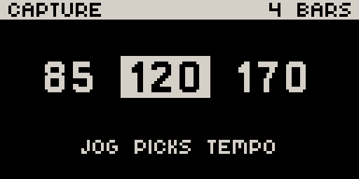

- **Non-destructive quantization** — every clip carries a strength from 0 to
  100 % applied as it plays, so the timing you recorded is never rewritten and
  you can dial it back at any time. **Shift + Step 16** cycles 0 / your default
  / 100 %; new clips are born with the default, which follows you into new sets.

  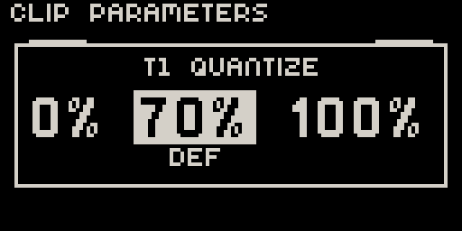

- **Undo & redo** — **Undo** takes back the last edit, **Shift + Undo** redoes
  it, and an overlay names what changed. One gesture is one undo: a whole knob
  turn, or one pass of live recording. Covers notes, clips, automation, synth
  parameters and module loads alike.

  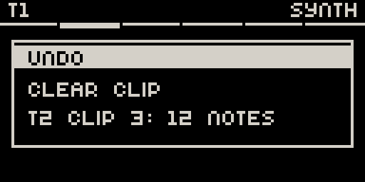

- **Scales & pad layouts** — the 32 pads become a chromatic fretboard or piano,
  or fold **in key** (4ths or inline) so a wrong note is impossible. Each
  track remembers its own octave, saved with the set.

  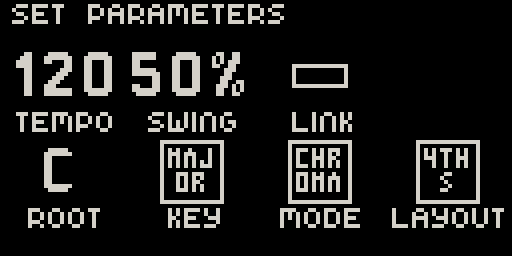

  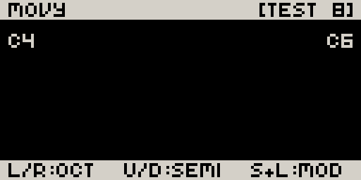

- **Drum support** — drum modules switch the pads to a 4×4 rack with per-pad
  parameter pages.

  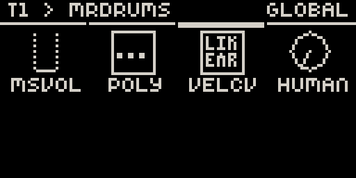

- **Beyond Move** — three pages of features Move doesn't have on-device:
  - **Step parameters** — per-trig velocity, length, probability, condition, invert.
  - **Clip parameters** — scale, length, transpose.
  - **Set parameters** — tempo, swing, root, key.

  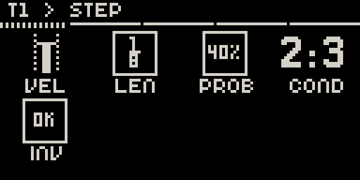

- **Settings — Shift + Step 2** — CPU optimization (multi-threaded chain
  render, worth roughly 2× on a heavy set) with one switch to turn it off if a
  module misbehaves, and which host owns tracks 1-4. The speed-up applies to
  Movy's own tracks, so new sets hand tracks 1-4 to Movy as well; sets you
  already have keep them on Schwung, behaving exactly as they do without Movy.
  Each row explains itself on screen.

  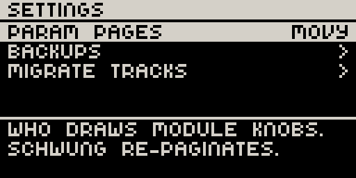

- **Background mode** — Back at the root opens a Leave menu; choose Background
  to keep Movy sequencing under Move's own screens (synced LFOs stay locked).
  Shift + Back exits instantly.
- **One transport with Move** — Movy locks to Move's transport (drift-free),
  follows its tempo, and shares tempo back through the TEMPO knob. Flip on the
  **LINK** toggle (Set page) and Play/Stop on either Movy or Move starts and
  stops both.

See the [manual](MANUAL.md) for how each of these works.

## Module support

Movy works with **most Schwung modules with no setup at all** — it reads each
module's parameter hierarchy and lays it out automatically.

Some modules use a **curated layout template** for a nicer arrangement. These
are especially important for **drums**, where there is otherwise no way to
switch the drum type from the device. A template can ship inside Movy or as a
`movy_config.json` beside the module itself.

**Tested drum modules:**

- [Mr Drums](https://github.com/handcraftedcc/schwung-mrdrums) — basic drums
- [Weird Dreams](https://github.com/filliformes/weird-dreams-move) — synth drums

Other modules will work via the generic layout; if a module deserves a custom
template (or you want to improve drum support), **contributions are welcome** —
see [CONTRIBUTING.md](CONTRIBUTING.md).

## Requirements

- An **Ableton Move** with the **[Schwung](https://github.com/charlesvestal/schwung)**
  framework installed.
- At least one Schwung sound-generator module to play.
- On your build machine: **Node.js** and **Rust**, plus a cross-compiler —
  `deploy.sh` builds two things, a JS UI bundle and a Rust sequencer engine
  (`dsp.so`) cross-compiled for the Move's aarch64 Linux.

## Install

Movy is a Schwung **tool module**. Build and deploy it to a Move reachable at
`move.local`:

```bash
# Rust toolchain (skip if you already have cargo)
curl --proto '=https' --tlsv1.2 -sSf https://sh.rustup.rs | sh
source "$HOME/.cargo/env"
rustup target add aarch64-unknown-linux-gnu

# aarch64 cross-compiler (macOS, via Homebrew)
brew tap messense/macos-cross-toolchains
brew install aarch64-unknown-linux-gnu

cd movy
npm install
./scripts/deploy.sh            # builds ui.js + the Rust engine (dsp.so), deploys both
```

Building on Linux? Install a `aarch64-linux-gnu-gcc` cross-compiler from your
package manager instead (e.g. `apt install gcc-aarch64-linux-gnu`) and point
`engine/.cargo/config.toml`'s linker at it.

Then open **Movy** from Schwung's Tools menu on the device. See
[CONTRIBUTING.md](CONTRIBUTING.md) for the full build/test workflow.

## Limitations

Movy intentionally tracks Move's behaviour, but it is **not** a full
reimplementation. Notable gaps (all candidates for future work — contributions
welcome):

- **No automation capture** — Capture keeps notes; knob moves are not captured.
- **Four Schwung tracks only** — not Move's native instruments, drum racks or
  sampler.
- Sequencer **resolution and some clip-level features** are simplified.

A fuller list, with context, is in the [manual](MANUAL.md#limitations-vs-move).

## Contributing & bug reports

Movy is open to contributions and bug reports. Please read
[CONTRIBUTING.md](CONTRIBUTING.md) first — it covers the build/test loop, how to
add a module layout template, and what makes a bug report actionable.

## License

[MIT](LICENSE) © megadake
